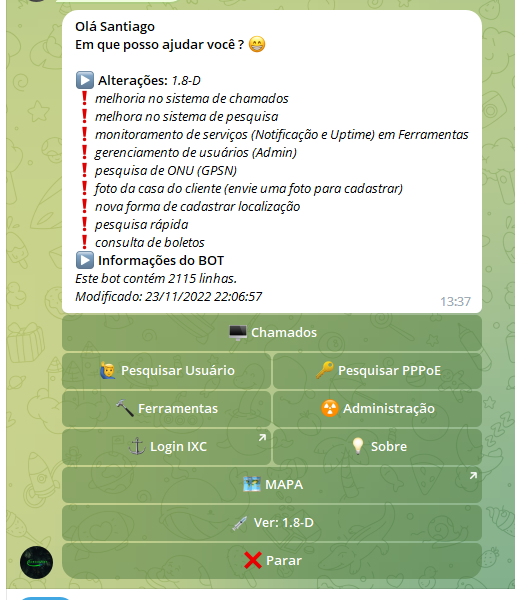
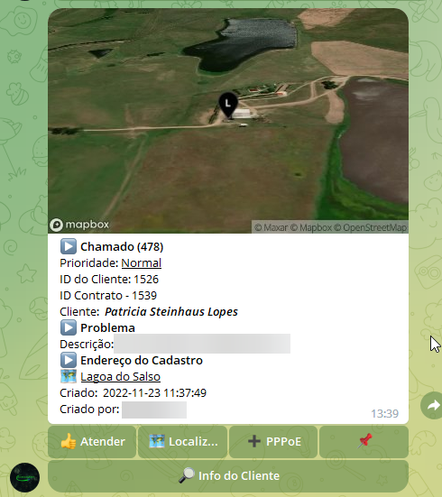
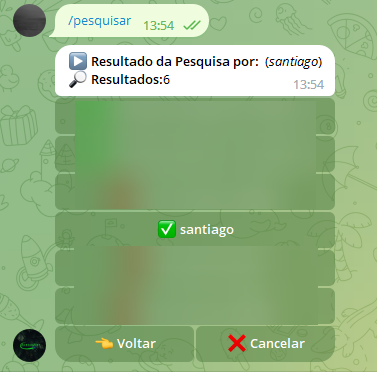
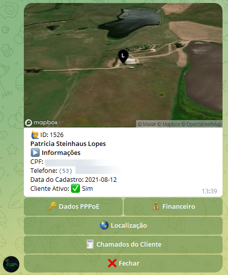
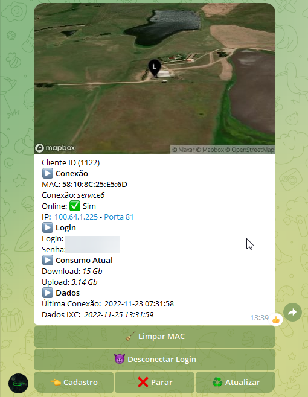
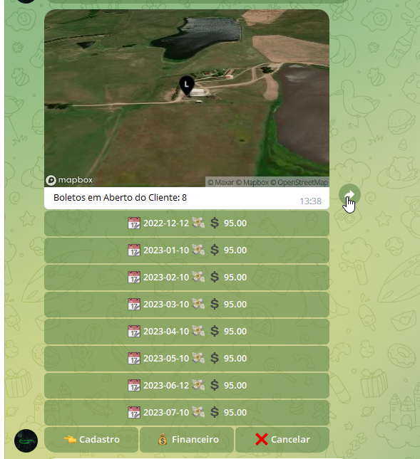

# Bot Telegram para [IXC Provedor](https://www.ixcsoft.com.br/ixcprovedor/)

<!---Esses são exemplos. Veja https://shields.io para outras pessoas ou para personalizar este conjunto de escudos. Você pode querer incluir dependências, status do projeto e informações de licença aqui--->

> Bot para Telegram em PHP para [IXC Provedor](https://www.ixcsoft.com.br/ixcprovedor/), movido pela [Wiki API do IXCProvedor](https://wikiapiprovedor.ixcsoft.com.br/).

### ➡️ LInk Telegram [Aceguanet_bot](https://t.me/Aceguanet_bot)

### Ajustes e melhorias

O projeto ainda está em desenvolvimento e as próximas atualizações serão voltadas nas seguintes tarefas:

- [x] Desenvolvimento inicial
- [x] Funções de API
- [x] Cache das consultas via API
- [x] Melhoria na pesquisa (Velocidade de resposta)
- [ ] Melhoria geral

## Algumas Funções

> Lista de Chamados

> Pesquisa de Clientes

> Informações do Cliente

> Dados do PPPoE

> Dados de Pagamento

## 💻 Pré-requisitos

Antes de começar, verifique se você atendeu aos seguintes requisitos:
<!---Estes são apenas requisitos de exemplo. Adicionar, duplicar ou remover conforme necessário--->
* Apache 2 ou Nginx
* PHP 5.4 ou superior
* API do IXC Provedo. [Wiki API do IXCProvedor](https://wikiapiprovedor.ixcsoft.com.br/).

## 📝 Licença
Projeto realizado para estudo e pesquisa.

Esse projeto está sob licença. Veja o arquivo [LICENÇA](LICENSE.md) para mais detalhes.

## 💻 Feito com
* PHP
* https://core.telegram.org/bots

[⬆ Voltar ao topo](#mapa_provedo) 
